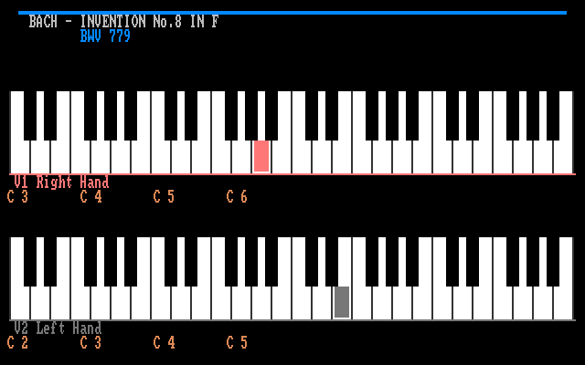
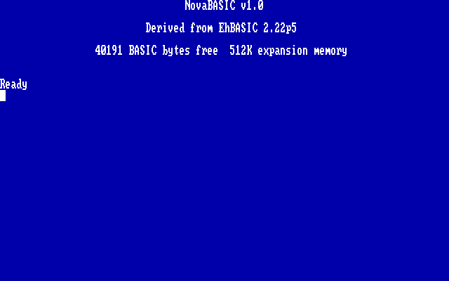
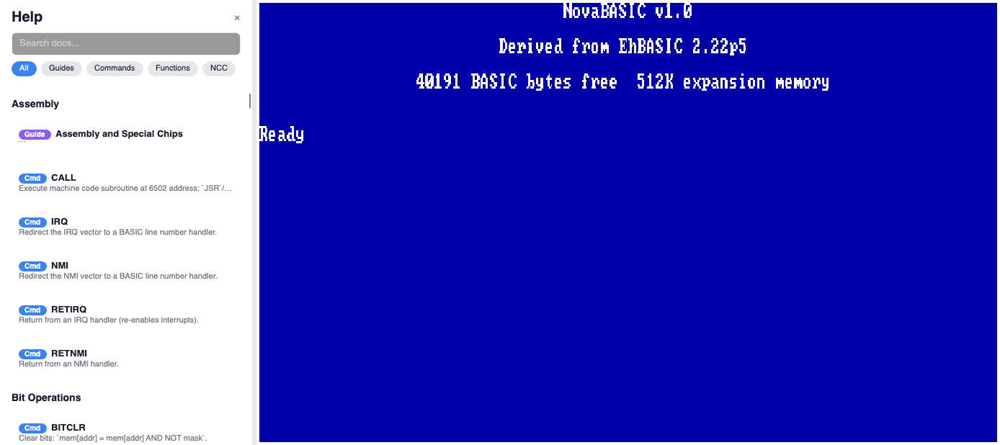
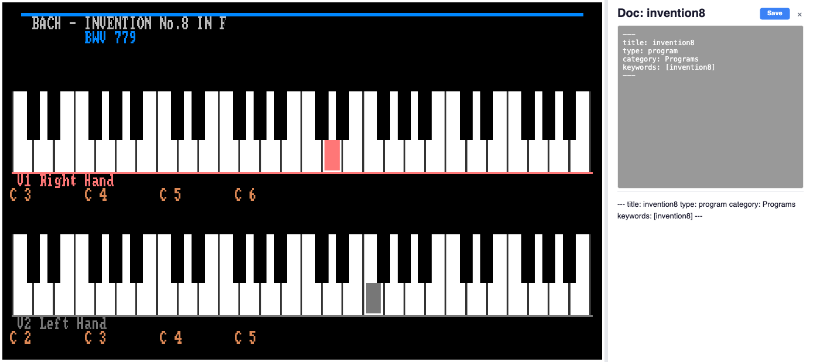
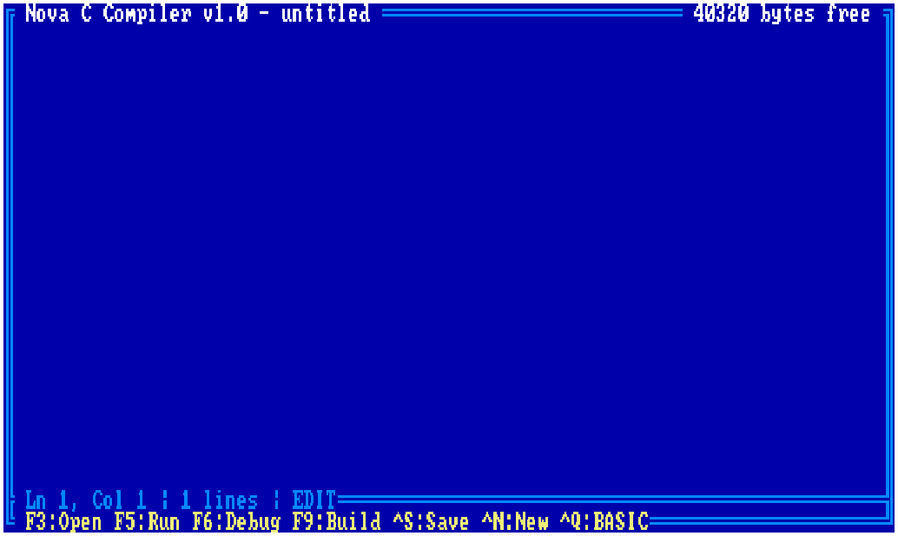

<p align="center">
  
</p>

<h1 align="center">N O V A V M</h1>

<p align="center">
  <em>A computer that never existed &mdash; built for an era that hasn't happened yet.</em>
</p>

<p align="center">
  <a href="#quickstart">Quickstart</a> &bull;
  <a href="#the-machine">The Machine</a> &bull;
  <a href="#ai-integration">AI Integration</a> &bull;
  <a href="#nova-basic">Nova BASIC</a> &bull;
  <a href="#ncc-compiler">NCC Compiler</a> &bull;
  <a href="#architecture">Architecture</a>
</p>

---

NovaVM is a fantasy computer built on a real CPU. It pairs a cycle-accurate **MOS 6502** with hardware that borrows the best ideas from the Commodore 64, Apple II, and NES &mdash; then wires the whole thing to an AI through the **Model Context Protocol**.

The result is a machine where you can write BASIC at the `Ready` prompt, hear your code through a **SID sound chip**, watch sprites glide across a 320&times;200 screen, and hand the keyboard to Claude so it can compose music, draw pixel art, and debug your assembly &mdash; all inside the same emulator window.

<p align="center">
  
  <br>
  <sub>40 KB of BASIC, 512 KB expansion, SID sound, sprites, and a blinking cursor. Ready.</sub>
</p>

## Quickstart

```bash
# Prerequisites: .NET 10 SDK
git clone https://github.com/barryw/NovaVM.git
cd NovaVM
dotnet run --project e6502.Avalonia
```

You'll see the boot screen and a blinking cursor. Type `PRINT "HELLO"` and hit Enter. You're in.

### Connect an AI

In a second terminal:

```bash
dotnet run --project e6502.MCP
```

This launches the MCP server on stdio. Point Claude Desktop, Claude Code, or any MCP client at it and start talking to the machine.

## The Machine

NovaVM isn't emulating a specific vintage computer. It's a **new design** that takes the 6502 seriously as a platform:

| Component | Spec |
|---|---|
| **CPU** | MOS 6502 / 65C02 @ 12 MHz, cycle-accurate, decimal mode, full interrupt handling |
| **RAM** | 64 KB flat + 512 KB expansion memory (banked) |
| **Display** | 80&times;25 text + 320&times;200 4-bit color graphics, 60 Hz |
| **Sprites** | 16 hardware sprites, 16&times;16 multicolor, 3 priority layers, collision detection |
| **Sound** | Dual MOS 6581 SID chips &mdash; 6 voices, ADSR envelopes, ring mod, sync, filters |
| **Music** | 6-voice MML sequencer with 16 instrument slots, SFX with voice stealing |
| **Fonts** | CP437 + PETSCII upper/lower, hot-swappable |
| **Network** | 4-slot TCP controller with DMA, IRQ on message arrival |
| **Timers** | Programmable interval timers with IRQ |
| **Storage** | File I/O controller &mdash; save/load programs, graphics, sprite data |
| **ROM** | EhBASIC 2.22 + NCC compiler ROM (hot-swappable) |
| **DMA** | Bulk transfer between CPU RAM, VRAM, expansion memory |
| **Copper** | Scanline-triggered register writes &mdash; 128 program lists, vblank-synchronized |
| **Blitter** | Hardware block copy/fill across all memory spaces |

### SID Sound

The SID chip emulation is a full software reimplementation of the MOS 6581 &mdash; not a sample player, not a shortcut. Three voices per chip, four waveforms (triangle, sawtooth, pulse, noise), ring modulation, oscillator sync, and a multimode state-variable filter. Two chips give you six independent voices rendered at 44.1 kHz through OpenAL.

The music engine sits on top: load MML sequences, define instruments with ADSR envelopes, and play multi-voice compositions while your BASIC program runs. Sound effects use voice stealing with priority so gameplay audio never interrupts the soundtrack.

### Sprites

Sixteen 16&times;16 multicolor sprites with per-pixel color (4-bit, 16 colors including transparent). Three priority layers let sprites appear behind text, between text and graphics, or in front of everything. Hardware collision detection reports sprite-to-sprite overlaps per frame. Flip horizontally or vertically without redrawing.

### Copper

Inspired by the Amiga's coprocessor, the copper executes a list of register writes synchronized to the raster beam. Each entry fires at a specific screen coordinate, letting you change background colors, scroll offsets, sprite positions, or graphics mode mid-frame &mdash; no CPU involvement. 128 independent program lists with up to 256 entries each, double-buffered at vblank for tear-free transitions. Rainbow gradients, split-screen effects, and vertical sprite multiplexing all run for free.

## AI Integration

NovaVM exposes its entire surface through the **Model Context Protocol**. The MCP server (`e6502.MCP`) bridges Claude to the emulator over a local TCP connection, giving the AI **50+ tools** to:

**Write & Run Code**
- Enter BASIC lines, run programs, read screen output
- Load `.bas` files directly into the interpreter

**Draw**
- Plot pixels, draw lines, circles, rectangles
- Flood fill, set colors, read the graphics layer back as ASCII art
- Design sprites pixel-by-pixel, position and animate them

**Compose**
- Define SID instruments with custom waveforms and ADSR
- Write MML sequences for 6-voice music
- Play sound effects, control tempo and looping
- Load and play `.sid` files from the C64 archive

**Debug**
- Pause/resume/step the CPU
- Set conditional breakpoints (`break at $C000 when A == $FF`)
- Read memory, disassemble instructions, inspect the stack

**Network**
- Open TCP connections, send/receive data
- Listen for incoming connections

```
You: "Write a BASIC program that draws a starfield with parallax scrolling"

Claude: [enters BASIC lines, defines star sprites, sets up animation loop,
         runs the program, reads the screen to verify it works]
```

The AI doesn't just generate code and hope &mdash; it **types it into the machine, runs it, reads the screen, and iterates**. It's pair programming with a 12 MHz computer in the loop.

## Nova BASIC

EhBASIC 2.22 extended with hardware-aware commands:

```basic
10 MODE 2 : CLS : GCLS
20 GCOLOR 9 : FILL 0,0,319,199
30 FOR I = 0 TO 15
40   GCOLOR I : CIRCLE 160,100,10+I*6
50 NEXT I
60 INSTRUMENT 0,$40,2,8,12,6
70 FOR N = 60 TO 72
80   SOUND N,8,0
90   PAUSE 4
100 NEXT N
```

Graphics, sound, sprites, music, file I/O, networking, and timer interrupts &mdash; all accessible from BASIC through memory-mapped registers and the file I/O command interface.

Press **F1** while a program is running for context-sensitive help. Press **Shift+F1** to edit the program's companion documentation.

<p align="center">
  
  <br>
  <sub>F1 opens the built-in help system &mdash; searchable, filterable by category, with "Try This" code snippets.</sub>
</p>

<p align="center">
  
  <br>
  <sub>Shift+F1 opens the companion doc editor. Every program can have its own help page.</sub>
</p>

## NCC Compiler

For when BASIC isn't fast enough. NCC is a C-like language that compiles to native 6502 machine code:

```c
byte x = 0;
while (true) {
    poke(0xA00E, x);    // character output register
    x = x + 1;
}
```

The NCC editor (**Ctrl+N**) provides a full IDE experience: syntax highlighting, build, run, debug with breakpoints, and step-through execution. The compiler supports structs, enums, pointers, arrays, fixed-point arithmetic, and inline assembly.

<p align="center">
  
  <br>
  <sub>The NCC editor: a full-screen IDE running inside the emulator itself.</sub>
</p>

## Architecture

```
┌─────────────────────────────────────────────────────────┐
│                    Avalonia GUI                          │
│  ┌──────────┐  ┌──────────┐  ┌────────┐  ┌──────────┐  │
│  │ Emulator │  │   Help   │  │  Doc   │  │   NCC    │  │
│  │  Canvas  │  │  Panel   │  │ Editor │  │  Editor  │  │
│  └────┬─────┘  └──────────┘  └────────┘  └──────────┘  │
│       │                                                  │
│  ┌────┴──────────────────────────────────────────────┐  │
│  │              CompositeBusDevice                    │  │
│  │  ┌─────┐ ┌─────┐ ┌─────┐ ┌─────┐ ┌────┐ ┌────┐  │  │
│  │  │ VGC │ │ SID │ │ NIC │ │Timer│ │ XMC│ │ FIO│  │  │
│  │  │     │ │ x2  │ │     │ │     │ │    │ │    │  │  │
│  │  └─────┘ └─────┘ └─────┘ └─────┘ └────┘ └────┘  │  │
│  │  ┌─────┐ ┌─────┐ ┌──────────┐ ┌──────────────┐   │  │
│  │  │ DMA │ │ BLT │ │  Music   │ │  SID Player  │   │  │
│  │  └─────┘ └─────┘ │  Engine  │ │  (.sid files) │   │  │
│  │                   └──────────┘ └──────────────┘   │  │
│  └────┬──────────────────────────────────────────────┘  │
│       │                                                  │
│  ┌────┴─────┐     ┌──────────────────┐                  │
│  │  6502    │     │   TCP Server     │◄── MCP Server    │
│  │  CPU     │     │   (port 6502)    │    (stdio)       │
│  └──────────┘     └──────────────────┘                  │
└─────────────────────────────────────────────────────────┘
```

### Memory Map

```
$0000-$01FF  Zero page + stack
$0200-$027F  Hardware vector table
$0280-$9FFF  BASIC program space (~40 KB)
$A000-$A0FF  VGC registers + command interface
$A100-$A13F  Network interface controller
$AA00-$B1CF  Character RAM (80x25)
$B1D0-$B99F  Color RAM (80x25)
$B9A0-$B9EF  File I/O controller
$BA00-$BA3F  Expansion memory controller
$BA40-$BA4F  Timer controller
$BC00-$BFFF  Expansion memory window (4x256 byte pages)
$C000-$FFFF  ROM (EhBASIC / NCC, write-protected)
$D400-$D41C  SID chip 1 (intercepted inside ROM space)
$D420-$D43C  SID chip 2
```

## Runtime Tuning

```bash
NOVA_CPU_HZ=12000000 dotnet run --project e6502.Avalonia   # Custom clock speed
NOVA_TURBO=1 dotnet run --project e6502.CLI                 # No speed limit
NOVA_TIMING_LOG=1 dotnet run --project e6502.Avalonia       # Timing telemetry
```

## Building

```bash
dotnet build                                # Build everything
dotnet test                                 # Run all 726 tests
dotnet run --project e6502.Avalonia         # Launch the GUI
dotnet run --project e6502.CLI              # Console-only BASIC
dotnet run --project e6502.MCP              # MCP server for AI clients
```

### Project Structure

| Project | Purpose |
|---|---|
| `e6502` | Core CPU emulator &mdash; 6502 + 65C02, pure C#, no dependencies |
| `e6502.Avalonia` | GUI with all hardware: VGC, SID, sprites, music, networking, NCC |
| `e6502.MCP` | MCP server bridging AI clients to the emulator via TCP |
| `e6502.CLI` | Headless BASIC interpreter for scripting |
| `e6502UnitTests` | 726 tests including Klaus Dormann's CPU validation suite |
| `e6502.Tools` | CLI utilities (SID file relocation) |

## Tests

CPU correctness is validated by running real 6502 test suite binaries to completion &mdash; Klaus Dormann's functional test, interrupt test, AllSuiteA, and 65C02 extended opcodes. Hardware tests cover the VGC, SID, sprites, timers, music engine, NIC, DMA, blitter, MML parser, SID file parser, and file I/O.

```bash
dotnet test --verbosity normal              # See individual test results
dotnet test --filter "RunAllSuiteTest"      # Run a specific test
```

## License

This project is built on [amensch/e6502](https://github.com/amensch/e6502). See [LICENSE](LICENSE) for details.

---

<p align="center">
  <sub>35,000+ lines of C# &bull; 726 tests &bull; 50+ MCP tools &bull; 6 SID voices &bull; 16 sprites &bull; 12 MHz of fun</sub>
</p>
