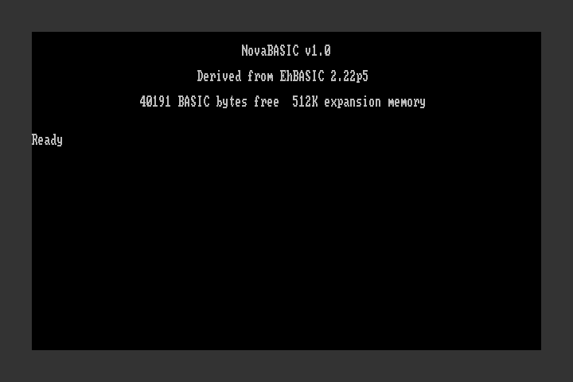

<p align="center">
  
</p>

<h1 align="center">N O V A V M</h1>

<p align="center">
  <em>A 6502/65C02 computer implemented as an emulator, an FPGA core, and a host bridge.</em>
</p>

<p align="center">
  <a href="#quickstart">Quickstart</a> &bull;
  <a href="#current-focus">Current Focus</a> &bull;
  <a href="#hardware-surface">Hardware Surface</a> &bull;
  <a href="#fpga-and-novahost">FPGA and NovaHost</a> &bull;
  <a href="#build-and-test">Build and Test</a>
</p>

---

NovaVM is a custom 6502-family computer platform. It started as a C# emulator
around a 6502 core, but the project is now centered on keeping one machine
model aligned across three targets:

- **Avalonia**: the reference desktop implementation and development UI.
- **Verilator**: a fast RTL simulation target for FPGA hardware validation.
- **ULX3S FPGA + ESP32 NovaHost**: the active hardware target, with HDMI
  output, SDRAM-backed expansion memory, SD-card storage, ROM loading, and
  debug control through the ESP32.

The machine is not a clone of any existing vintage computer. It keeps the
6502 programming model, then adds Nova-specific devices: video, sprites, DMA,
blitter, copper lists, expansion RAM, file I/O, audio, and target-specific
host services such as networking and debug control.

The screenshot above is the current boot frame from the Avalonia hardware
model: a 720x480 output frame with a centered 640x400 Nova canvas and visible
border. That geometry matches the default video profile used by the FPGA and
Verilator builds.

## Quickstart

```bash
# Prerequisites: .NET 10 SDK
git clone https://github.com/barryw/NovaVM.git
cd NovaVM
dotnet restore e6502.sln
dotnet run --project e6502.Avalonia
```

The Avalonia host boots NovaBASIC and starts a local emulator control server.
Type BASIC at the `Ready` prompt, or use the TCP/MCP tooling to drive the
machine programmatically.

The Avalonia build currently rebuilds the NovaBASIC ROM and help artifacts
before launch. For a full local build, have `ca65`, `ld65`, `python3`,
`pandoc`, and a LaTeX toolchain available.

## Current Focus

The main work is hardware parity and system integration:

- keep Avalonia, Verilator, and FPGA behavior aligned,
- stabilize the ULX3S video, reset, timing, sprite, DMA, and XRAM paths,
- make ESP32 NovaHost the owner of SD-card files, ROM loading, boot assets,
  NDI disk images, and debug transport,
- standardize flat 24-bit XRAM access for BASIC, assembly, and future
  language runtimes,
- keep NovaBASIC useful as the default runtime while leaving room for other
  runtime/personality ROM work later.

Polished demos are intentionally secondary until the VM is stable. The README
should describe the machine we are building, not hide the hardware bring-up
behind an old desktop-only demo.

## Hardware Surface

| Component | Current shape |
|---|---|
| **CPU** | 6502/65C02 core, 12 MHz target, 64 KB address space |
| **Main memory** | 64 KB CPU-visible RAM/ROM/MMIO map |
| **ROM** | NovaBASIC/EhBASIC at `$C000-$FFFF`; Avalonia also has NCC/extension ROM switching |
| **XRAM** | 512 KB expansion memory, treated as a flat 24-bit byte address space |
| **XRAM windows** | Four 256-byte mapped windows at `$BC00-$BFFF` |
| **Display** | VGC output targeting 720x480, with a 640x400 Nova canvas |
| **Text** | 80x50 character, color, and text-attribute planes |
| **Bitmap graphics** | 320x200 4-bit graphics layer |
| **Sprites** | 16 hardware sprites, 16x16 pixels, shape RAM, priority, and collision paths |
| **Tiles** | Tile engine registers and tile data memory |
| **Copper** | Raster-positioned register writes and IRQ events |
| **DMA** | Bulk copy/fill across CPU RAM, VGC memory spaces, sprites, tiles, and XRAM |
| **Blitter** | Rectangular copy/fill with stride and color-key support |
| **Audio** | Dual SID model, SID playback, music engine, plus Avalonia-side wavetable-synth work |
| **Storage** | FIO controller, host directories, NDI images, and direct XRAM load/save paths |
| **Network** | Four-slot message-oriented TCP NIC in the Avalonia target |

The important design rule is that custom hardware is not an emulator trick.
Whenever possible, the same register model and memory behavior should exist in
Avalonia, Verilator, and FPGA.

## NovaBASIC and Assembly

NovaBASIC is EhBASIC 2.22 extended with machine-specific commands for the
hardware surface:

- graphics, sprites, color, font, and text control,
- SID sound, MML music, MIDI/SID playback paths,
- DMA and blitter commands,
- XRAM allocation, banking, windows, `XLOAD`, and `XSAVE`,
- file, host-directory, and NDI-backed storage commands,
- TCP networking commands in the Avalonia host,
- IRQ/NMI helpers and low-level `PEEK`/`POKE` access.

Assembly code can use the shared XRAM runtime in `ehbasic/xram.inc` and
`ehbasic/xram.s`. BASIC keeps a convenient `XBANK` plus 16-bit offset model,
while assembly routines can treat XRAM as a 24-bit flat address space.

## FPGA and NovaHost

The FPGA tree is a first-class implementation target, not an afterthought.

`e6502.FPGA/rtl/` contains the synthesizable system: top-level bus fabric,
VGC, text/gfx/sprite/tile/copper logic, DMA, blitter, FIO, SID modules,
SDRAM-backed XRAM, the debug bridge, and the 6502 core.

`e6502.FPGA/test/` contains Verilator/SystemVerilog tests for the hardware
blocks and top-level integration paths. The FPGA bring-up workflow uses these
tests before hardware flashing whenever possible.

`e6502.ESP32/novahost/` is the ESP32 companion firmware. NovaHost owns the SD
card and exposes the current hardware management surface:

- ROM and extension-ROM loading,
- cold start and debug control,
- SD file access and mounted NDI image support,
- FIO event handling,
- boot assets and staged configuration files,
- HTTP and TCP management/debug endpoints.

Today, command-line disk-image work lives in `e6502.NDI`. Broader `nova`
device-manager tooling for disks, ROMs, soundfonts, boot assets, and hardware
status is still planning work, not a finished CLI.

## MCP Integration

The Model Context Protocol server still exists, but it is no longer the whole
story of the project.

```bash
dotnet run --project e6502.MCP
```

The MCP server talks to the running Avalonia host over the local emulator TCP
server. It can type BASIC, read the screen, manipulate hardware state, inspect
memory, drive graphics and audio tools, and help debug programs. It is useful
for development and automation, but the core goal is now consistent Nova
hardware behavior across all targets.

## Build and Test

```bash
dotnet restore e6502.sln
dotnet build e6502.sln -c Release
dotnet test e6502.sln -c Release
```

Useful target-specific commands:

```bash
dotnet run --project e6502.Avalonia       # Desktop reference host
dotnet run --project e6502.CLI            # Headless BASIC host
dotnet run --project e6502.MCP            # MCP bridge
dotnet run --project e6502.NDI            # NDI image utility
make -C ehbasic                           # Rebuild NovaBASIC ROM artifacts
make -C e6502.FPGA                        # Build the Verilator simulator
make -C e6502.FPGA run                    # Run the Verilator simulator
make -C e6502.FPGA/fpga bitstream         # Build ULX3S bitstream
```

FPGA bitstream builds require the OSS CAD Suite tools (`yosys`,
`nextpnr-ecp5`, `ecppack`) and `openFPGALoader` for programming hardware.
ESP32 NovaHost builds use the Arduino ESP32 toolchain.

## Project Structure

| Path | Purpose |
|---|---|
| `e6502/` | Core 6502/65C02 CPU emulator library |
| `e6502.Avalonia/` | Desktop reference machine, VGC/audio/storage/network devices, editors, TCP bridge |
| `e6502.Browser/` | Browser/WebAssembly host experiment sharing Avalonia hardware/rendering code |
| `e6502.CLI/` | Terminal-hosted NovaBASIC runner |
| `e6502.MCP/` | MCP server for external control of the Avalonia host |
| `e6502.NDI/` | NDI disk-image command-line tooling |
| `e6502.Storage/` | NDI and host-directory storage abstractions |
| `e6502.Tools/` | Host-side utilities such as SID relocation/conversion helpers |
| `e6502Debugger/` | Windows Forms debugger project |
| `e6502.FPGA/` | SystemVerilog RTL, Verilator simulation, ULX3S build flow, FPGA tests |
| `e6502.ESP32/novahost/` | ESP32 companion firmware for SD, debug, ROM loading, and host services |
| `ehbasic/` | NovaBASIC/EhBASIC source, extension ROM, XRAM runtime, token definitions |
| `docs/help/` | User-facing NovaBASIC help book and command reference |
| `docs/mapping/` | "Mapping the NovaVM" hardware/memory-map book sources |
| `docs/plans/` | Architecture, bring-up, and future feature planning docs |
| `tests/integration/` | Assembly-level integration suites for simulator/hardware backends |
| `e6502UnitTests/` | MSTest suite for CPU, devices, storage, editors, compiler, and host behavior |

## Documentation

The best current technical references are:

- `docs/help/guides/memory-map.md`
- `docs/help/guides/assembly.md`
- `docs/help/guides/expansion-memory.md`
- `docs/help/guides/dma-and-blitter.md`
- `docs/fpga-debugging-workflow.md`
- `docs/mapping/`
- `docs/plans/`

The docs are evolving along with the hardware. Recent planning documents are
often more accurate than old screenshots or demo programs.

## License

This project is built on [amensch/e6502](https://github.com/amensch/e6502).
See [License.txt](License.txt) for details.
